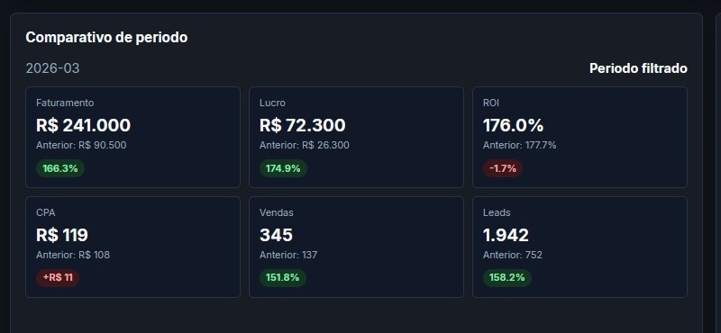
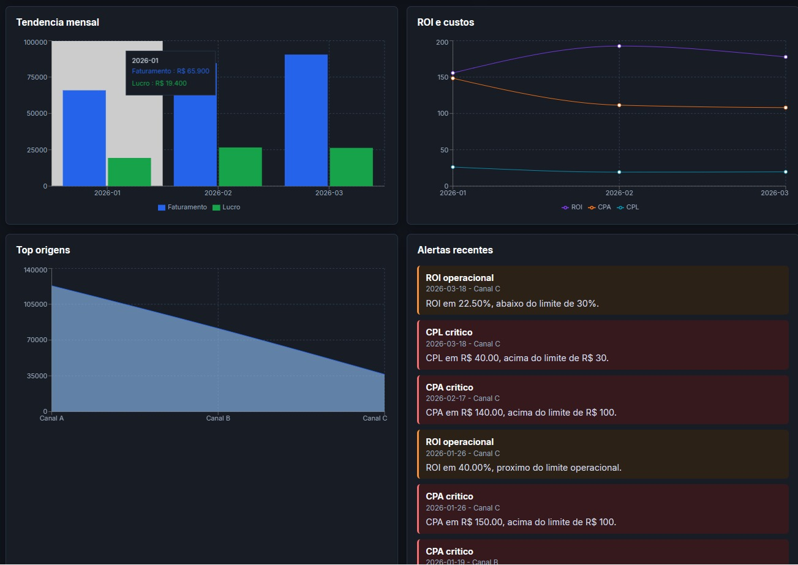

# KPI Monitoring Platform

Plataforma MVP para monitoramento de KPIs de negócio a partir de planilhas Excel.

O projeto permite importar arquivos, tratar dados comerciais, persistir informações no Supabase/PostgreSQL e visualizar indicadores como faturamento, lucro, ROI, margem, CPA, CPL, leads e vendas.

A aplicação foi desenvolvida como projeto de portfólio para demonstrar um fluxo completo de análise de dados e BI: upload, tratamento, persistência, visualização, alertas operacionais e exportação de informações processadas.

---

## Links

- Deploy: https://kpi-monitoring-platform.netlify.app
- Dashboard: https://kpi-monitoring-platform.netlify.app/#dashboard
- Repositório: https://github.com/Joao-MF-Jesus/KPI-monitoring-platform

---

## Demonstração

Os prints do projeto devem ser armazenados na pasta `docs/`.

### Dashboard principal


### Comparativo de período



### Alertas operacionais



---

## Problema resolvido

Muitas empresas acompanham indicadores comerciais em planilhas separadas, o que dificulta a análise de desempenho, a comparação entre períodos e a identificação rápida de problemas operacionais.

Este projeto centraliza os dados, transforma planilhas em indicadores visuais e ajuda a acompanhar a evolução de métricas importantes para o negócio, aproximando o fluxo de trabalho de uma solução de BI aplicada.

---

## Funcionalidades

- Upload de planilhas Excel com dados comerciais.
- Modo demo para visitantes, sem alterar a base real do Supabase.
- Login administrativo para persistência de dados.
- Salvamento no Supabase para administrador autenticado.
- Dashboard com KPIs de faturamento, lucro, ROI, margem, CPA, CPL, leads e vendas.
- Comparativo entre períodos para análise de evolução.
- Leitura executiva com resumo dos principais resultados.
- Alertas operacionais para CPA, CPL e ROI.
- Exportação de KPIs, alertas e logs processados.
- Interface publicada e acessível via Netlify.

---

## Tecnologias utilizadas

- React
- TypeScript
- Vite
- Supabase
- PostgreSQL
- Recharts
- XLSX
- Netlify
- Python
- Pandas
- Streamlit legado

---

## Arquitetura resumida

```text
frontend/              Aplicação React publicada no Netlify
frontend/src/          Interface, parser da planilha e dashboard principal
supabase/              Schema, seed e policies de acesso ao banco
src/                   Pipeline Python/ETL e regras auxiliares de KPIs
app/dashboard.py       Dashboard Streamlit legado
logs/                  Registros gerados no processamento local
```

A versão publicada usa o frontend React com Supabase como base de dados. A estrutura Python/Streamlit permanece no repositório como parte da evolução do projeto e demonstra o fluxo inicial de análise e prototipação.

---

## Fluxo principal

1. O usuário acessa a landing page do projeto.
2. O visitante pode visualizar o dashboard com dados já publicados.
3. O visitante pode importar uma planilha em modo demo local.
4. No modo demo, os dados são tratados e exibidos apenas na sessão atual.
5. Um administrador autenticado pode substituir ou adicionar dados no Supabase.
6. O dashboard recalcula KPIs, gráficos, comparativos e alertas.
7. Os dados processados podem ser exportados em CSV.

---

## Modo demo e segurança

O projeto foi preparado para funcionar como link público de portfólio.

Visitantes podem testar planilhas em modo demo, mas não possuem permissão para alterar a base real do Supabase. Nesse fluxo, a planilha é processada localmente no navegador e os indicadores são atualizados apenas durante a sessão atual.

Administradores autenticados podem salvar dados no Supabase, respeitando as policies configuradas no banco.

---

## Indicadores calculados

- Faturamento
- Lucro
- ROI
- Margem
- CPA
- CPL
- Leads
- Vendas
- Ticket médio
- Comparativo de período
- Alertas operacionais por desempenho

---

## Formato esperado da planilha

A planilha deve conter colunas relacionadas a datas, origem/canal e indicadores comerciais. O parser aceita variações de nomes, mas o formato recomendado é:

| Coluna | Descrição |
| --- | --- |
| data | Data de referência do registro |
| source_sheet | Origem, canal ou aba de referência |
| investimento_ads | Investimento em mídia paga |
| leads | Quantidade de leads gerados |
| vendas | Quantidade de vendas realizadas |
| faturamento | Receita gerada |
| lucro | Lucro estimado ou informado |
| cpa | Custo por aquisição |
| cpl | Custo por lead |
| roi | Retorno sobre investimento |
| margem | Margem de lucro |

---

## Como rodar localmente

### Frontend React

```powershell
cd frontend
npm install
copy .env.example .env
npm run dev
```

No arquivo `frontend/.env`, configure as variáveis públicas do Supabase:

```env
VITE_SUPABASE_URL=sua_url_do_supabase
VITE_SUPABASE_PUBLISHABLE_KEY=sua_chave_publica
```

### Pipeline Python e dashboard legado

```powershell
python -m venv .venv
.\.venv\Scripts\Activate.ps1
pip install -r requirements.txt
python main.py
streamlit run app/dashboard.py
```

---

## Supabase

O projeto utiliza Supabase/PostgreSQL para persistência dos dados.

Arquivos principais:

- `supabase/schema.sql`: criação das tabelas e índices.
- `supabase/seed.sql`: dados iniciais de demonstração.
- `supabase/authenticated_read_policies.sql`: leitura para usuários autenticados.
- `supabase/authenticated_write_policies.sql`: escrita para usuários autenticados.

As policies foram organizadas para permitir leitura pública dos dados de demonstração e restringir alterações no banco a usuários autenticados.

---

## Segurança

- Visitantes não possuem permissão de escrita no Supabase.
- O modo demo não altera a base principal.
- A chave privada de service role não é usada no frontend.
- Variáveis públicas do Supabase ficam no ambiente do frontend.
- Operações de insert/delete são restritas a usuários autenticados.

---

## Status

Projeto em versão MVP, desenvolvido para demonstrar um fluxo completo de análise de dados aplicado a um contexto de negócio.

O sistema já possui deploy público, dashboard funcional, modo demo, autenticação administrativa, persistência em banco, alertas e exportações.

---

## Próximos passos

- Adicionar perfis de usuário e controle administrativo mais granular.
- Melhorar validação de planilhas antes da importação.
- Criar histórico de importações.
- Adicionar testes automatizados para o parser e cálculos principais.
- Evoluir alertas com regras configuráveis.
- Adicionar mais visualizações analíticas para BI.

---

## Autor

Desenvolvido por **João Marcelo Ferreira de Jesus**.

- GitHub: https://github.com/Joao-MF-Jesus
- LinkedIn: https://www.linkedin.com/in/joao-marcelo-f-jesus
